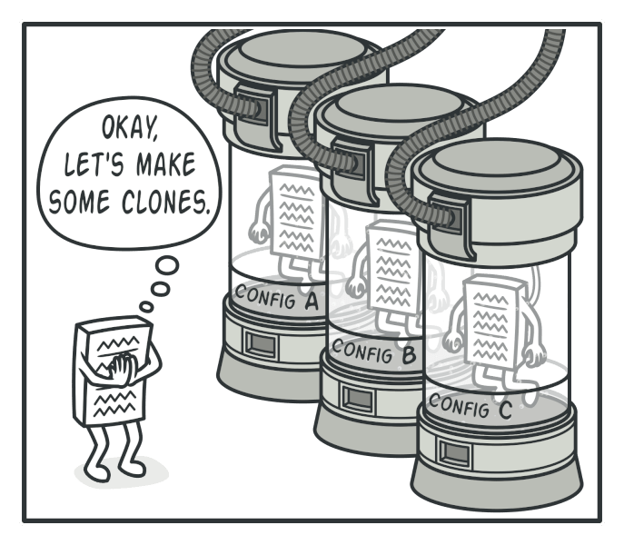
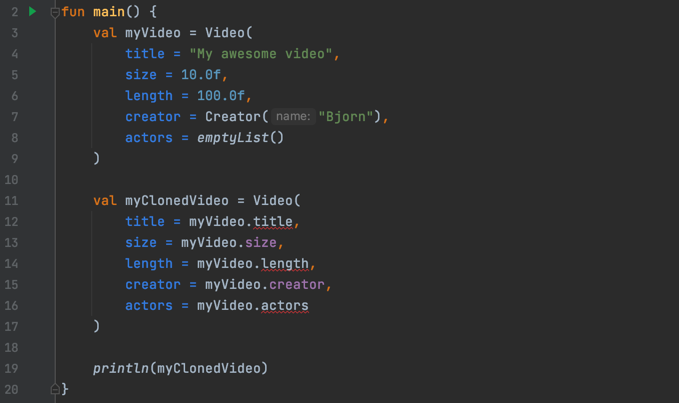
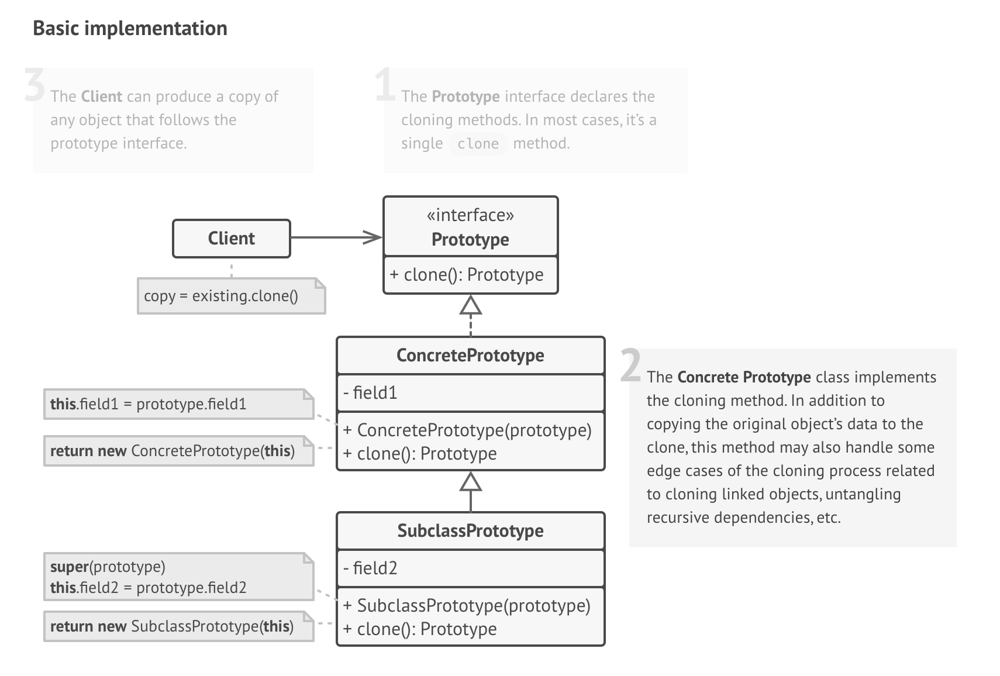
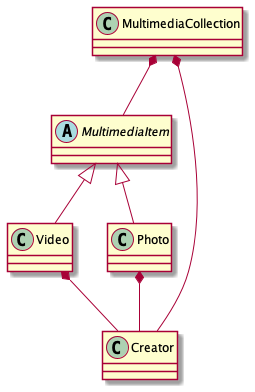
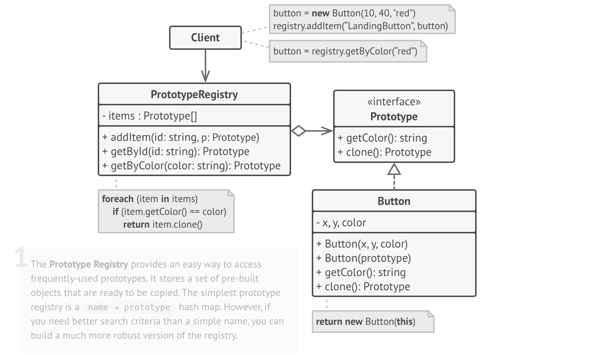

# Prototype pattern

## Bjorn, Chapter Time, December 2021

---

# We want to make a copy of an object

---

# But we run into a problem

Here we might want to look at another way to **create** the new object. We could use the Prototype pattern!

---

# What and why is the Prototype pattern?

**Prototype pattern**
Prototype is a **creational** design pattern that **delegates** cloning to the actual objects that are being cloned. The
object that is being cloned is called a prototype. It's applied if you cannot just (easily) instantiate a new object.

**Problem 1**
Some of the **fields might be private** and then we will not be able to copy.

**Problem 2**
Even if you could, copying is now **dependent** on the concrete Video class. If the class is from a third-party library,
then you might not have access to the class but only to the objects created using this class or an implemented
interface.

(**Problem 3** Instantiation might be very expensive)

---

# Basic structure of the Prototype pattern

- We create a common interface for all clonable objects.
- We now have access to the private fields (problem 1 solved) and the creation is now decoupled from the concrete
  class (problem 2 solved).

---

# Let's look at an example

Let's say we have a MultimediaCollection object and we need to create a copy of it and want to preserve all fields of
the nested Video and Photo objects. Unfortunately, we cannot access all fields in Video and Photo classes.

---

# Demo time

1. What if some fields are private?
2. What if the concrete classes are private?

---

# Bonus: Prototype often includes a registry

